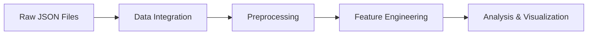

# 🎵 Spotify Wrapped Analysis & Personal Music Journey (2020-2025)

## 🌟 Project Overview
> A data-driven exploration of personal music streaming habits, created for the Maven Spotify Wrapped Challenge.

[](https://www.python.org/)
[](https://www.tableau.com/)
[](https://mavenanalytics.io)

## 📊 Analytics Snapshot

| Metric | Value |
|--------|--------|
| 🎧 Total Streams | 46,119 |
| ⏱️ Total Hours | 1,460 |
| 🎵 Unique Songs | 10,453 |
| 🎤 New Artists | 689 |
| 🌍 Countries | 5 |
| 📱 Platforms | 6 |

## 🎯 Challenge Context
Every December, millions anticipate their **Spotify Wrapped** – a personalized celebration of their musical year. This project reimagines that experience through custom analytics and visualizations spanning multiple years of listening history.

## 🛠️ Data Processing Pipeline



### Key Processing Steps

1. **Data Integration & Cleaning**
   - Multiple JSON file consolidation
   - Platform name standardization
   - Timestamp normalization
   - Geographic data enrichment

2. **Feature Engineering**
   - Listening duration calculations
   - Session analysis
   - Geographic distribution mapping
   - Platform usage patterns

3. **Data Standardization**
   ```python
   # Platform Standardization
   platform_mapping = {
       'Linux [x86-64 0]': 'LINUX',
       'Android OS 10': 'ANDROID',
       'Windows 10': 'WINDOWS',
       'ios': 'IOS'
   }
   ```

## 📈 Key Insights

### Platform Distribution
```
ANDROID   ████████████████ 16,651 plays
WINDOWS   ███████████████  15,412 plays
IOS       ██████████████   13,865 plays
OTHERS    █                  191 plays
```

## 📱 Content Analytics

### Top Artists & Hours
1. Anirudh Ravichander - 71.0 hrs
2. Taylor Swift - 70.0 hrs
3. A.R. Rahman - 65.0 hrs
4. Alan Walker - 45.0 hrs
5. Hiphop Tamizha - 42.0 hrs

### Performance Metrics
- Track Completion Rate: 49.0%
- Average Daily Listening: 1.2 hrs
- Shuffle Success Rate: 57.68%
- Online Play Ratio: 99.30%
- Skip Rate: 22.31%

## 🗂️ Project Structure
```
spotify-analysis/
├── data/
│   └── processed/
│       └── Audio_Data_Frame_Final_v2_2020_2025.csv
├── notebooks/
│   └── Data-Preprocessing.ipynb
├── visualizations/
│   └── tableau/
└── README.md
```

## 🚀 Technical Implementation

### Technologies Used
- Python (pandas, pytz, datetime)
- Tableau
- JSON Processing
- Time Series Analysis

### Data Processing Steps
```python
# Example of timezone handling
def convert_to_local_time(row):
    utc_time = row['utc_time_zone_ts']
    country = row['conn_country']
    if country in timezones:
        local_tz = pytz.timezone(timezones[country])
        return utc_time.astimezone(local_tz)
    return utc_time
```

## 🎯 Future Enhancements

- [ ] Genre analysis integration
- [ ] Mood-based classification
- [ ] Listening pattern predictions
- [ ] Interactive dashboard development
- [ ] Social sharing features

## 👤 Author

**Mohammed Abdul Rahman Kalwathi**
- GitHub: [@kalwathi123](https://github.com/kalwathi123/Spotify)

## 🙏 Acknowledgments

- Maven Analytics for the challenge opportunity
- Spotify for comprehensive data access
- Open source community for analytical tools

---
<div align="center">

*Created with ❤️ for data analytics*

[🔝 Back to Top](#)
</div>
